# 定番商品リピート購入ECアプリ 設計仕様書

- 版：0.2
- 作成日：2026年9月12日
- 関連文書：[要求定義書](./要求定義書.md)、[要件定義書](./要件定義書.md)
- 本書の技術構成・未確認の細部は設計提案である。本書作成時点でアプリの実装は行っていない。
- 本書はGUを題材にした学習用アプリの設計であり、GU公式サービスの仕様を示すものではない。

---

## 1. システム構成

### 1.1 全体構成

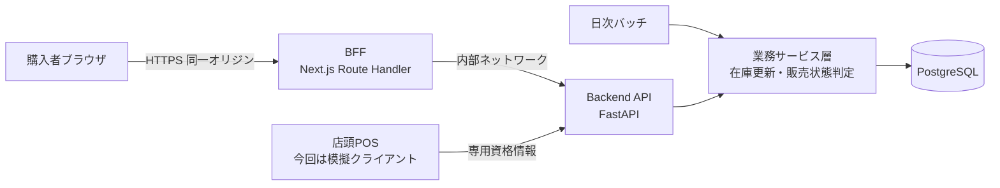

購入者のブラウザは BFF とのみ通信し、Backend API を直接呼ばない。BFF は同一オリジンで
Cookie を受け取り、内部ネットワーク経由で API を呼び出す。API はインターネットに直接公開
しない。

在庫の減算ロジックは業務サービス層に一本化し、EC購入・POS販売の両方から同じ処理を使う。
新規に作るのはPOSからの受け口と重複排除のみである。

### 1.2 技術構成

| 層 | 採用 | 選定理由 |
|---|---|---|
| Frontend | Next.js（TypeScript） | 型定義により、APIの入出力をコンパイル時に検査する |
| BFF | Next.js Route Handler | ブラウザと同一オリジンで Cookie を扱い、API を非公開に保つ |
| Backend | FastAPI（Python） | Pydantic による入力検証 |
| ORM | SQLAlchemy + Alembic | 問い合わせのパラメータバインドとスキーマ移行 |
| DB | PostgreSQL | 在庫スナップショットの蓄積と、行ロックによる同時実行制御 |
| バッチ | Python スクリプト（cron 等で起動） | 業務サービス層を共有する |

採用バージョンは実装開始時にサポート状況と既知の脆弱性を確認して固定する（8.8）。

### 1.3 作る範囲

| # | 機能 | 画面 |
|---|---|---|
| 1 | ログイン | 会員登録、ログイン |
| 2 | 商品表示 | 商品一覧、商品詳細 |
| 3 | 購入 | 注文確認、注文完了 |
| 4 | 購入履歴 | 履歴一覧（販売状態つき、再購入導線） |
| 裏 | POS販売の受け口 | 画面なし |
| 裏 | 日次バッチ | 画面なし |

---

## 2. UML

### 2.1 ユースケース図

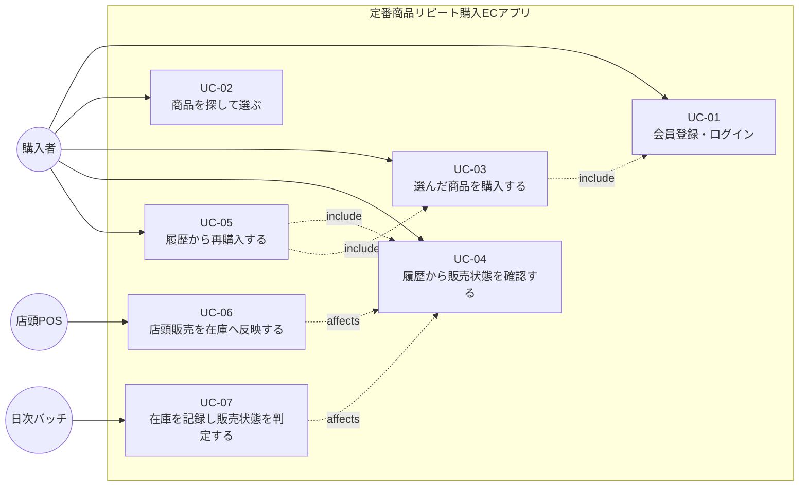

### 2.2 アクティビティ図：日次バッチによる販売状態判定

本アプリの中核となる処理である。「品切れ」と「終売」を分ける判断がここで行われる。

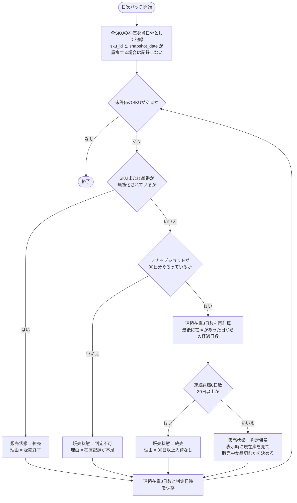

**連続在庫0日数を「加算」ではなく「再計算」にしている理由**：カウンタを加算する方式では、
バッチが同日に二重実行されたときに日数が過大になる。スナップショットから毎回導出すれば、
何回実行しても結果が同じになる（冪等）。障害からの再実行を安全にするための設計である。

導出の考え方（例示）：

```sql
-- 最後に在庫があった日を求め、そこからの経過日数を連続在庫0日数とする
WITH last_in_stock AS (
    SELECT sku_id, MAX(snapshot_date) AS last_date
    FROM inventory_snapshot
    WHERE on_hand > 0
    GROUP BY sku_id
)
SELECT s.id AS sku_id,
       CURRENT_DATE - COALESCE(l.last_date, :records_start_date) AS out_of_stock_days
FROM sku s
LEFT JOIN last_in_stock l ON l.sku_id = s.id;
```

### 2.3 シーケンス図

#### SD-01 会員登録・ログイン（UC-01）

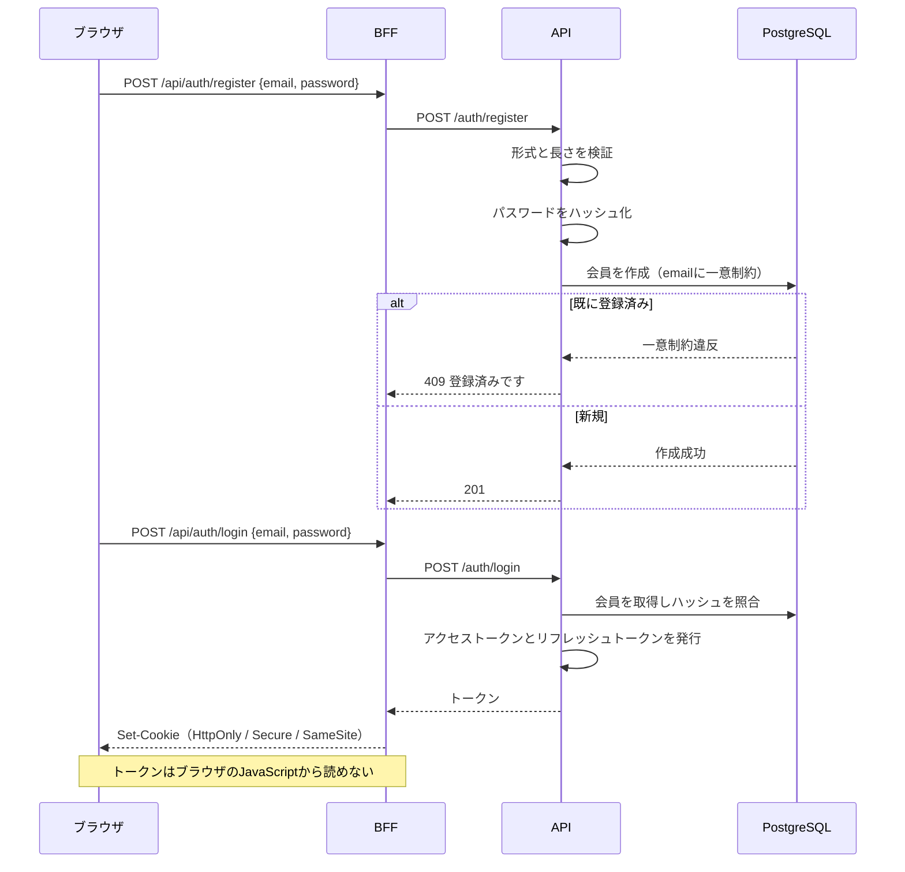

#### SD-02 購入（UC-03／UC-05 共通）

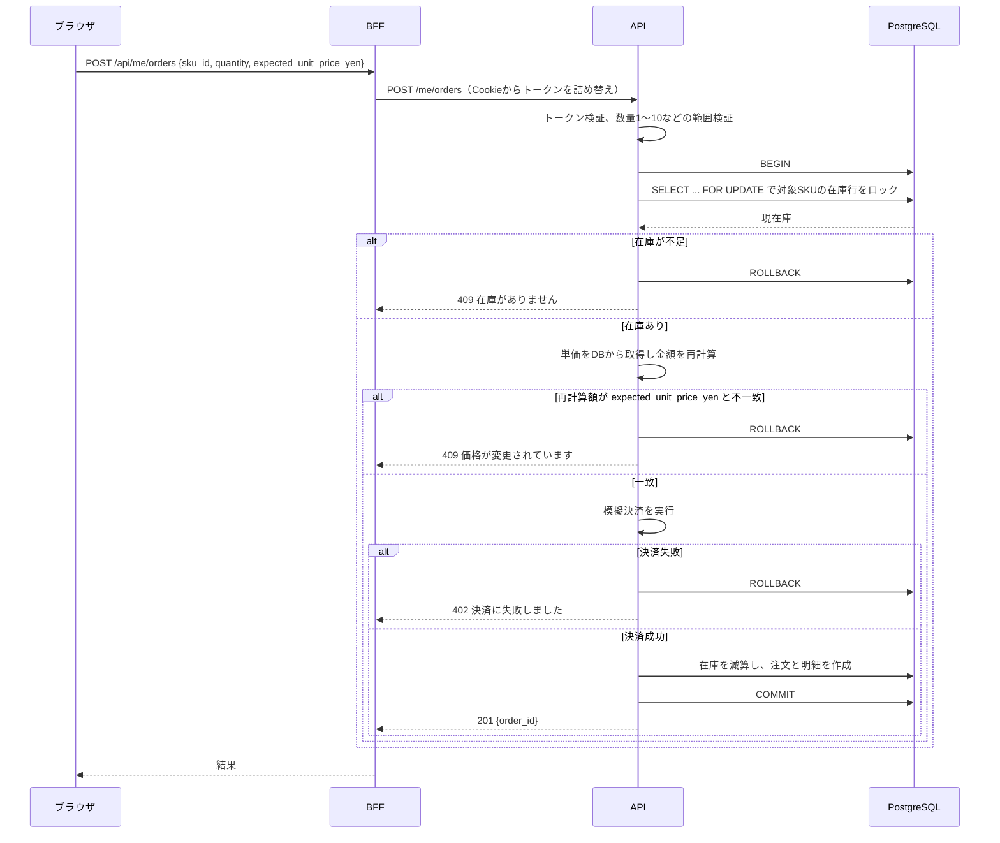

通常購入（UC-03）と履歴からの再購入（UC-05）は同じ処理を通る。違いは、再購入では
`expected_unit_price_yen` に**購入時ではなく現在の価格**を渡す点だけである。

金額の照合を行う理由は改ざん対策だけではない。再購入は**去年の履歴から行う**ため、価格改定が
起きている可能性が通常の購入より高い。サーバ側で再計算し、購入者が見ていた価格と異なる場合は
確認を求める（F-18）。

#### SD-03 購入履歴の表示（UC-04）

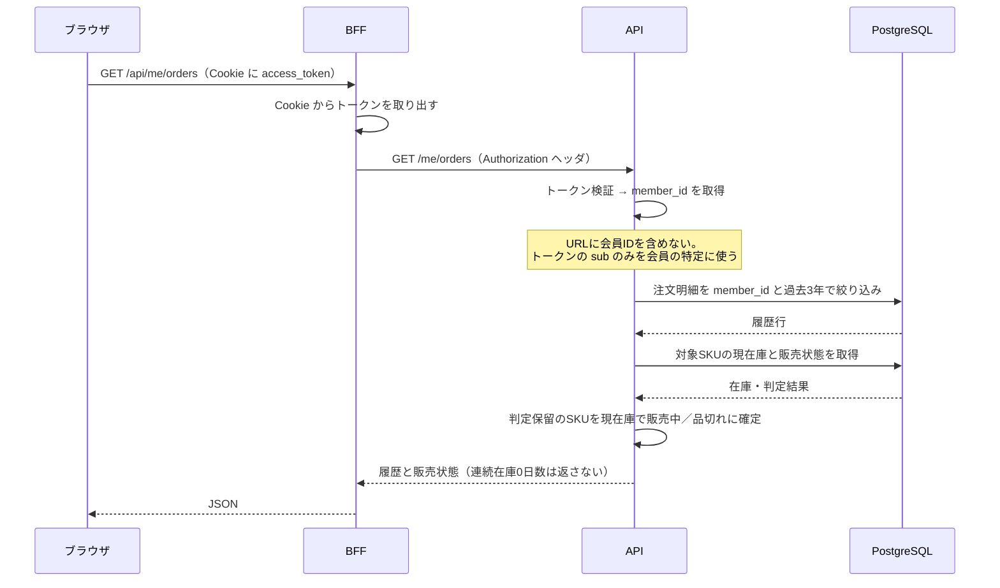

#### SD-04 店頭POS販売の在庫反映（UC-06）

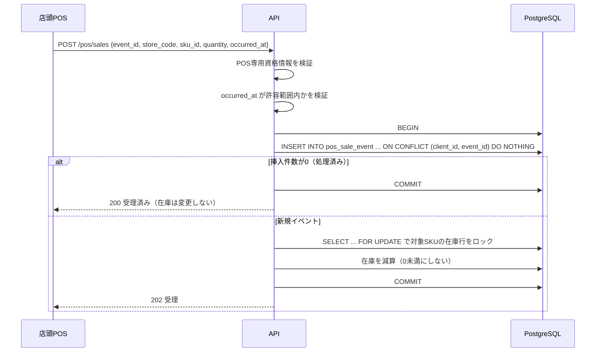

### 2.4 クラス図

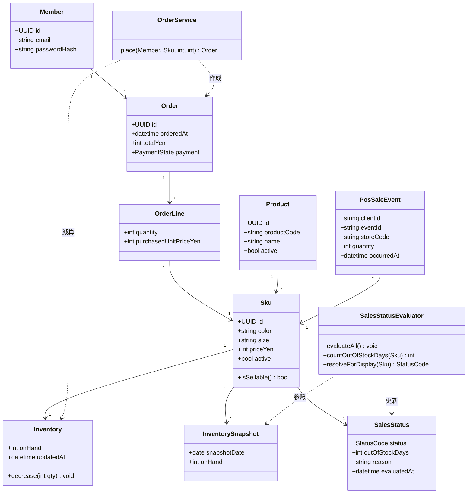

`OrderService.place()` はEC購入とPOS販売の在庫減算で共通のロジックを使う。
`SalesStatusEvaluator` は日次バッチと表示時の両方から使われ、`evaluateAll()` がバッチ、
`resolveForDisplay()` が表示時のリアルタイム確定を担う。

---

## 3. ER図

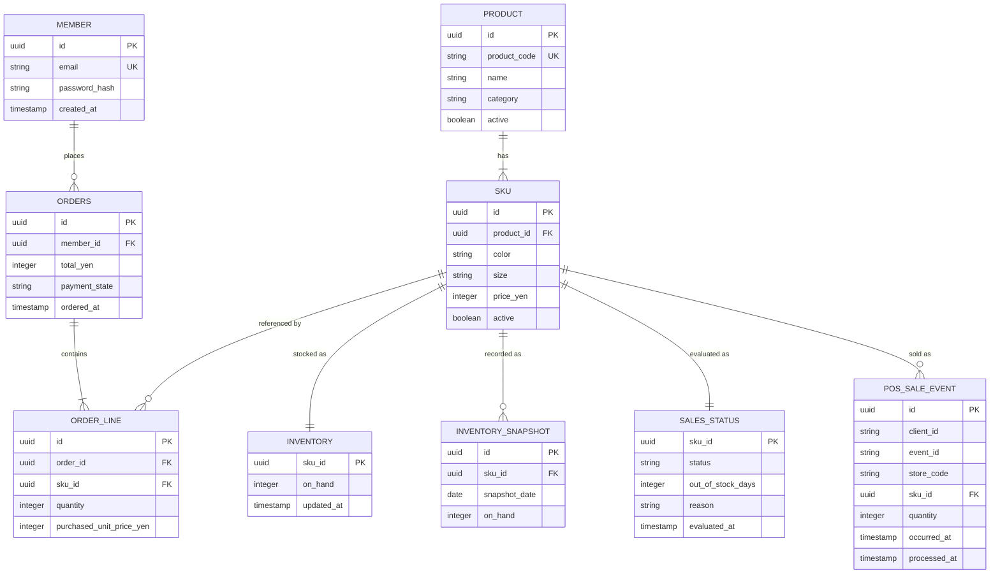

### 3.1 設計上の要点

| 項目 | 設計 | 理由 |
|---|---|---|
| `ORDER_LINE.sku_id` | 品番ではなくSKUを参照する | 色・サイズを記録しなければ「同じものを買う」が成立しない。後からSKU化しても過去の注文の色・サイズは復元できない |
| `INVENTORY_SNAPSHOT` | SKUごとの在庫を日次で保持 | 連続在庫0日数の唯一の根拠。記録開始前の期間は復元できない |
| `INVENTORY` | SKU単位。店舗マスタを持たない | 「どの店舗にあるか」は本課題の問いではない。店舗別に持つとデータ量が店舗数倍になる |
| `POS_SALE_EVENT.store_code` | 文字列として記録するのみ | 今回は店舗マスタを作らない。将来の店舗別在庫（S3）で正規化する |
| `PRODUCT.active` / `SKU.active` | 物理削除せず無効フラグで表す | 削除すると購入履歴から商品名を引けなくなる |
| `SALES_STATUS` | 判定結果を保持するテーブル | 履歴表示のたびに30日分を集計すると重い。日次バッチで事前計算する |
| `SALES_STATUS.out_of_stock_days` | 保持するが顧客には返さない | 在庫量や仕入の状況を推測させる内部指標。運用・調査に使う |
| `POS_SALE_EVENT` | `(client_id, event_id)` に一意制約 | 販売イベントの再送で在庫を二重に減算しないため |
| `INVENTORY_SNAPSHOT` | `(sku_id, snapshot_date)` に一意制約 | バッチの二重実行で同日を重複記録しないため |
| 注文の状態 | 中間状態を持たず、確定か不成立のみ | カート・取り置き・キャンセルを扱わないため、在庫の確保と解放を設計しなくてよい |
| 金額 | 整数（円） | 浮動小数点による誤差を避ける |
| 日時 | UTC で保存し、日本時間で表示 | 日付境界の判定を一貫させる |

---

## 4. API一覧

BFF は `/api/*` を受け、Backend の同名パスへ転送する。以下は Backend 側の契約を示す。

### 4.1 エンドポイント一覧

| # | メソッド・パス | 認可 | 対応機能 |
|---|---|---|---|
| 1 | POST /auth/register | 公開 | 1 ログイン |
| 2 | POST /auth/login | 公開 | 1 ログイン |
| 3 | POST /auth/refresh | リフレッシュトークン | 1 ログイン |
| 4 | POST /auth/logout | 認証済み | 1 ログイン |
| 5 | GET /products | 公開 | 2 商品表示 |
| 6 | GET /products/{product_id} | 公開 | 2 商品表示 |
| 7 | GET /skus/{sku_id}/sales-status | 公開 | 2 商品表示／4 履歴 |
| 8 | POST /me/orders | 本人のみ | 3 購入／4 再購入 |
| 9 | GET /me/orders | 本人のみ | 4 購入履歴 |
| 10 | POST /pos/sales | POS専用資格情報 | 裏 POS受け口 |

**パスに会員IDを含めない。** 対象の会員はアクセストークンの `sub` からのみ決定する。
これにより、URLのIDを差し替えて他人の情報を要求する経路そのものを作らない（S-02）。

### 4.2 入出力の型定義

型は TypeScript 表記で示す。Backend 側は Pydantic モデルで同じ制約を定義する。

#### 共通

```typescript
type SalesStatusCode = "ON_SALE" | "OUT_OF_STOCK" | "DISCONTINUED" | "UNKNOWN";
```

#### 1 POST /auth/register ／ 2 POST /auth/login

```typescript
type AuthRequest = {
  email: string;      // 1〜254文字、メールアドレス形式
  password: string;   // 12〜128文字
};
// register: 201（本文なし） / login: 204 + Set-Cookie
```

#### 5 GET /products

入力（クエリ文字列）

| キー | 型 | 必須 | 既定 | 制約 |
|---|---|---|---|---|
| q | string | 任意 | — | 0〜100文字。商品名の部分一致 |
| page | integer | 任意 | 1 | 1以上1000以下 |
| per_page | integer | 任意 | 20 | 1以上100以下 |

```typescript
type ProductListItem = {
  product_id: string;      // UUID
  product_code: string;
  name: string;
  min_price_yen: number;   // integer
};
type ProductListResponse = {
  items: ProductListItem[];
  page: number;
  per_page: number;
  total: number;
};
```

#### 6 GET /products/{product_id}

```typescript
type SkuItem = {
  sku_id: string;              // UUID
  color: string;
  size: string;
  price_yen: number;           // integer
  purchasable: boolean;        // 在庫数は返さない
};
type ProductDetailResponse = {
  product_id: string;
  product_code: string;
  name: string;
  description: string;
  skus: SkuItem[];
};
```

#### 7 GET /skus/{sku_id}/sales-status

```typescript
type SalesStatusResponse = {
  sku_id: string;
  sales_status: SalesStatusCode;
  evaluated_at: string | null;   // ISO 8601
};
```

在庫数と連続在庫0日数は返さない。いずれも在庫量や仕入の状況を推測させる内部指標であり、
顧客の判断に必要な情報は販売状態の区分だけで足りるためである。

#### 8 POST /me/orders

```typescript
type CreateOrderRequest = {
  sku_id: string;                     // UUID
  quantity: number;                   // integer 1以上10以下
  expected_unit_price_yen: number;    // integer 画面に表示していた単価
};
type CreateOrderResponse = {
  order_id: string;                   // UUID
  total_yen: number;
  ordered_at: string;                 // ISO 8601
};
```

#### 9 GET /me/orders

入力（クエリ文字列）：`page`（1〜1000、既定1）、`per_page`（1〜100、既定20）

```typescript
type OrderHistoryItem = {
  order_line_id: string;                 // UUID
  ordered_at: string;                    // ISO 8601
  product_code: string;
  product_name: string;
  color: string;
  size: string;
  quantity: number;                      // integer
  purchased_unit_price_yen: number;      // integer 購入時の単価
  current_unit_price_yen: number | null; // 終売時は null
  sales_status: SalesStatusCode;
  evaluated_at: string | null;
  can_reorder: boolean;
};
type OrderHistoryResponse = {
  items: OrderHistoryItem[];
  page: number;
  per_page: number;
  total: number;
};
```

`can_reorder` をサーバが返すのは、表示可否の判断をクライアントに委ねないためである。
クライアントはこの値に従うが、サーバは注文時に改めて検証する。

#### 10 POST /pos/sales

```typescript
type PosSaleRequest = {
  event_id: string;      // POS側で一意。同一取引明細に対して常に同じ値
  store_code: string;    // 1〜32文字
  sku_id: string;        // UUID
  quantity: number;      // integer 1以上100以下
  occurred_at: string;   // ISO 8601
};
type PosSaleResponse = {
  accepted: boolean;
  duplicated: boolean;   // 既に処理済みのイベントなら true
};
```

---

## 5. 入力値の下限・上限

| 対象 | 型 | 下限 | 上限 | 既定 | 超過時 |
|---|---|---|---|---|---|
| email | string | 1文字 | 254文字 | — | 422 |
| password | string | 12文字 | 128文字 | — | 422 |
| q（商品名検索） | string | 0文字 | 100文字 | — | 422 |
| page | integer | 1 | 1000 | 1 | 422 |
| per_page | integer | 1 | 100 | 20 | 422 |
| quantity（購入） | integer | 1 | 10 | 1 | 422 |
| quantity（POS販売） | integer | 1 | 100 | — | 422 |
| expected_unit_price_yen | integer | 0 | 1,000,000 | — | 422 |
| store_code | string | 1文字 | 32文字 | — | 422 |
| occurred_at | ISO 8601 | 現在時刻−7日 | 現在時刻＋5分 | — | 422 |
| 履歴の遡及年数（設定値） | integer | 1 | 5 | 3 | 起動時エラー |
| 終売判定日数（設定値） | integer | 1 | 365 | 30 | 起動時エラー |
| スナップショット保持日数（設定値） | integer | 30 | 1825 | 1095 | 起動時エラー |

`occurred_at` に範囲を設けるのは、POS側の時計ずれや過去日時の送信によって在庫の整合性が
崩れることを防ぐためである。範囲外は受理せず、運用側で確認する。

設定値は起動時に検証し、範囲外なら起動を失敗させる。実行中に不正な閾値で判定が走ることを
防ぐ。

---

## 6. エラー処理

### 6.1 HTTPステータスの割り当て

| ステータス | 条件 | 画面表示 | ログに残すもの／残さないもの |
|---|---|---|---|
| 400 | 形式不正（JSONが壊れている等） | 入力内容をご確認ください | 残す：パス、エラー種別／残さない：本文全体 |
| 401 | 未認証、トークン失効、ログイン失敗 | メールアドレスまたはパスワードが正しくありません | 残す：パス／残さない：トークン、パスワード |
| 402 | 模擬決済の失敗 | お支払いに失敗しました | 残す：注文の一時ID |
| 403 | POS資格情報の権限不足 | — | 残す：client_id |
| 404 | 商品が存在しない。**他人の注文を指定した場合も404** | 対象が見つかりません | 残す：パス、認証済み会員ID／残さない：要求されたID |
| 409 | 会員登録の重複、在庫不足、価格変更 | 状況に応じた説明を表示 | 残す：sku_id、判定結果 |
| 422 | 型・範囲の検証エラー | 項目ごとの説明を表示 | 残す：項目名と違反種別／残さない：値そのもの |
| 429 | 試行回数の超過（ログイン等） | しばらくしてからお試しください | 残す：発生元 |
| 500 | 想定外の例外 | 時間をおいてお試しください | 残す：スタックトレース、相関ID |

### 6.2 401 と 404 の使い分け

**ログイン失敗は、メールアドレスの存在有無を区別しない。** 「登録されていません」と
「パスワードが違います」を出し分けると、どのメールアドレスが登録済みかを外部から調べられる。
どちらも同じ文言で401を返す。

**権限のないリソースには404を返す。** 403を返すと、そのIDのリソースが存在することを要求者に
伝えてしまう。存在の有無自体を秘匿する。

なお本設計ではパスに会員IDを含めない構造（4.1）を採っているため、この経路は限定的である。

### 6.3 バッチ・連携の失敗

| 事象 | 処理 |
|---|---|
| 日次バッチが途中で失敗 | 当日分を再実行できる。一意制約と再計算方式により二重記録・過大計上が起きない |
| バッチが当日実行されなかった | 翌日の実行で欠測日が生じる。欠測日は在庫0とみなさず、判定不可の扱いとする |
| 販売イベントの重複受信 | `(client_id, event_id)` の一意制約で検知し、在庫を変更せず受理済みを返す |
| 在庫が不足する販売イベント | 在庫を0で止め、差異を記録する。在庫を負にしない |
| 模擬決済の失敗 | 注文を成立させず、在庫の減算も行わない（同一トランザクション内でロールバック） |

---

## 7. 状態遷移

### 7.1 販売状態

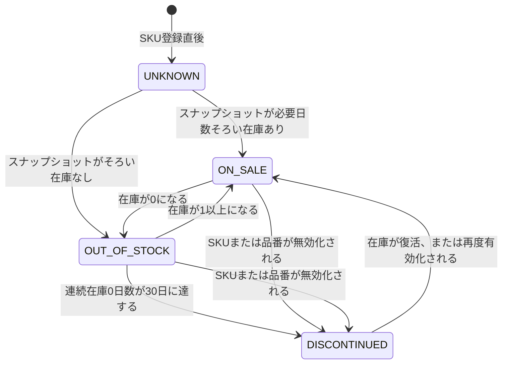

`DISCONTINUED` は最終状態ではない。誤判定や再販に対応するため、在庫が復活した場合は
`ON_SALE` へ戻し、連続在庫0日数を0にリセットする。

### 7.2 注文

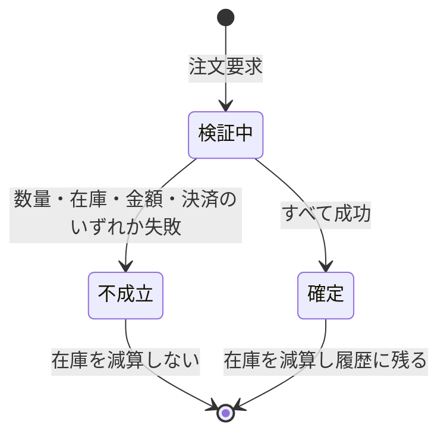

カート・取り置き・キャンセルを扱わないため、中間状態を持たない。在庫の確保と解放を設計
しなくてよくなり、同時実行の検討範囲が「注文確定時の行ロック」だけに収まる。

---

## 8. セキュリティ設計

### 8.1 認証（JWT）

| 項目 | 設計 |
|---|---|
| アクセストークン | 有効期限15分。署名アルゴリズムを明示的に固定し、`alg: none` や算法差し替えを受け付けない |
| リフレッシュトークン | 有効期限7日。データベースに保管し、使用時にローテーションする。再利用を検知したら系列全体を失効させる |
| 保管場所 | HttpOnly・Secure・SameSite=Lax の Cookie。**localStorage や sessionStorage に置かない** |
| 失効 | ログアウト時にリフレッシュトークンを削除する |
| パスワード | bcrypt 等のハッシュ関数で保存する。平文・可逆暗号で保存しない |
| ログイン試行 | 回数制限を設ける。失敗理由を出し分けない（6.2） |

localStorage を使わないのは、スクリプト経由でトークンが読み出される事故を、保管方法の段階で
防ぐためである。HttpOnly Cookie はJavaScriptから参照できない。

### 8.2 認可

本アプリの中核データは購入履歴であり、これは個人の購買行動そのものである。他人に見られては
ならない。

| 対策 | 内容 |
|---|---|
| 会員の特定 | アクセストークンの `sub` からのみ会員を決定する。リクエストボディ・クエリ・パスの会員IDを一切信用しない |
| 経路の遮断 | `/me/...` の構造とし、パスに会員IDを持つエンドポイントを作らない |
| 検証位置 | 検証は Backend で行う。BFF や画面側の表示制御だけに依存しない |
| 情報漏れの抑止 | 他人のリソースには404を返し、存在の有無を伝えない（6.2） |

### 8.3 BFF（リバースプロキシ）

- ブラウザは BFF とのみ通信する。Backend API はインターネットに公開しない。
- BFF は Cookie からトークンを取り出し、Backend への `Authorization` ヘッダに詰め替える。
  ブラウザ側のJavaScriptはトークンを保持しない。
- BFF は転送先パスを固定の許可リストで制限し、任意のURLへ中継しない（SSRF対策）。
- Backend は BFF の送信元のみを受け付けるようネットワークで制限する。

### 8.4 CORS

- ブラウザから見て BFF は同一オリジンであるため、通常の画面操作でCORSは発生しない。
- Backend 側の CORS 設定は、許可オリジンを BFF のオリジンのみに限定する。`*` を使わない。
- 認証情報を伴う通信では、仕様上 `allow_origins` にワイルドカードを指定できない。
  許可オリジンは環境変数で明示する。
- 許可メソッド・許可ヘッダも必要なものだけに限定する。

### 8.5 サーバ側での計算と照合

| 対象 | 設計 |
|---|---|
| 金額 | クライアントから受け取った `expected_unit_price_yen` を保存や請求に使わない。単価はDBから取得して再計算し、一致しない場合は409で拒否する |
| 数量 | 上限10をサーバ側で検証する。画面の入力制限だけに依存しない |
| 在庫 | 表示時の値ではなく、注文確定時に行ロックを取って再判定する |
| 販売状態 | クライアントが送る `can_reorder` 等を信用しない。注文処理時に改めて判定する |

画面上の制限を回避したリクエストでも、不正な注文が成立しないことを確認する。

### 8.6 API仕様書の非公開

FastAPI は既定で `/docs`、`/redoc`、`/openapi.json` を公開する。本番環境ではすべて無効化
する。`openapi.json` を残すとスキーマ全体が取得できるため、3つとも止める。

```python
is_production = settings.ENV == "production"

app = FastAPI(
    docs_url=None if is_production else "/docs",
    redoc_url=None if is_production else "/redoc",
    openapi_url=None if is_production else "/openapi.json",
)
```

### 8.7 SQLインジェクション対策

| 層 | 対策 |
|---|---|
| Frontend | TypeScript で API の入出力型を定義し、想定外の値の送信をコンパイル時に検出する |
| Backend 入口 | Pydantic モデルで型・範囲・書式を検証する。UUIDはUUID型として受け取り、文字列のまま扱わない |
| データアクセス | SQLAlchemy のクエリビルダを使い、値をパラメータとしてバインドする |
| 生SQL | 集計など必要な箇所では `text()` とバインドパラメータを用いる。文字列連結・書式化でSQLを組み立てない |

商品名の部分一致検索（`GET /products?q=`）は利用者の入力を直接扱うため、特に注意する。

```python
# 不可：値をSQL文字列に埋め込む
session.execute(text(f"SELECT * FROM product WHERE name LIKE '%{q}%'"))

# 可：パラメータとしてバインドする
session.execute(
    text("SELECT * FROM product WHERE name LIKE :pattern"),
    {"pattern": f"%{q}%"},
)
```

### 8.8 依存ライブラリの脆弱性

- 採用するフレームワーク・ライブラリのバージョンを一覧化し、実装開始時にサポート状況と
  既知の脆弱性を確認して固定する。
- 依存関係の検査（Python は `pip-audit`、Node.js は `npm audit`）を実施し、継続的に
  確認できるようにする。
- ロックファイルをリポジトリに含め、環境間でバージョンを一致させる。
- 検査結果と対応方針を記録し、対応できないものは理由を残す。

### 8.9 秘密情報とログ

- 認証情報・署名鍵・接続情報は環境変数で管理し、リポジトリに含めない。
- ログにトークン、パスワード、購入履歴の内容を出力しない。
- エラーには相関IDを付与し、利用者には内部構造を表示しない。
- 公開環境ではHTTPSを使用する。

---

## 9. 検証計画

要件定義書の受け入れ確認項目 A-01〜A-18 を受け入れテストとして実装する。特に重要なものを
以下に示す。

### 9.1 境界値

| 対象 | 確認内容 |
|---|---|
| 終売判定 | 連続在庫0日数が29日では「品切れ」、30日で「終売」になる |
| 遡及期間 | 3年ちょうど前の購入が表示され、3年と1日前は表示されない |
| 判定不可 | スナップショットが29日分では「判定不可」、30日分そろうと判定される |
| 数量 | 10点は成立し、11点と0点は422で拒否される |
| ページング | per_page=100は成立し、101は422で拒否される |
| パスワード長 | 12文字は登録でき、11文字は422で拒否される |

### 9.2 認可・認証

| 対象 | 確認内容 |
|---|---|
| 他人の注文 | 他人の注文IDを指定した要求が404になり、内容が返らない |
| 未認証 | ログインせずに `/me/orders` を要求すると401になる |
| トークン改ざん | 署名を書き換えたトークンが拒否される |
| ログイン失敗 | 未登録メールと誤ったパスワードで、同じ応答が返る |
| POS資格情報 | 購入者の認証情報で `/pos/sales` を呼べない |

### 9.3 同時実行・冪等性

| 対象 | 確認内容 |
|---|---|
| 同時注文 | 在庫1のSKUへ同時に2件注文すると、成立は1件のみ。在庫が負にならない |
| 二重送信 | 注文ボタンの二重クリックで注文が2件成立しない |
| イベント再送 | 同一 `event_id` を2回送信しても在庫の減算は1回 |
| バッチ二重実行 | 同日に2回実行しても、スナップショットが重複せず判定も変わらない |
| バッチ再実行 | 途中失敗後の再実行で、判定結果が単独実行時と一致する |
| 決済失敗 | 決済に失敗した注文で在庫が減っていない |

### 9.4 検証用データ

在庫スナップショットを含む初期データを用意する。

- SKU：在庫あり／在庫0が29日継続／在庫0が30日継続／在庫0が31日継続／SKU無効化済み／
  スナップショットが29日分しかないもの、を各1件以上。
- 購入履歴：3年以内と3年より前の購入、価格が改定された商品、終売品を含む。
- 会員：複数会員を用意し、他人の履歴を参照できないことを確認できるようにする。

### 9.5 検証環境の注意

同時実行の検証は PostgreSQL 上で、独立した接続・トランザクションを用いて実際に並行実行
する。SQLite では行ロックの挙動が異なるため、在庫の排他制御の検証には使用しない。

---

## 10. 店頭POSに必要となる変更と接続契約

今回EC側に用意するのは受け口までで、POS本体の改修は行わない。ここでは接続の契約と、POS側に
必要となる変更を定義する。

### 10.1 接続契約

`POST /pos/sales`。拠点に紐づいた専用資格情報を使い、購入者の認証とは分離する。

```json
{
  "event_id": "pos-store-a-sale-123-line-1",
  "store_code": "store-a",
  "sku_id": "3f2a1c88-0000-4000-8000-000000000001",
  "quantity": 1,
  "occurred_at": "2026-09-12T10:00:00+09:00"
}
```

`event_id` は取引IDと明細IDから決定的に生成し、再送しても同じ値になるようにする。同じ
`client_id` と `event_id` の組み合わせは、在庫を変更せず最初の結果を返す。

送信は会計確定と同一トランザクションで確定させず、POS側の送信用テーブルに記録したうえで別
処理が送る方式とする。EC側との通信失敗が店頭の会計を止めないためである。

### 10.2 POS側に必要となる変更

Lv2で開発したPOSは、単一店舗内で会計を完結させる前提で成立していた。ECと接続すると、
以下の変更が必要になる。

| # | 変更内容 | 段階 | 後から取り戻せるか |
|---|---|---|---|
| 1 | 商品管理を品番単位からSKU単位（品番×カラー×サイズ）へ変更する | 在庫反映に必要 | 仕組みは後から追加できる |
| 2 | 会計確定時に販売イベントを送信する | 在庫反映に必要 | 仕組みは後から追加できる |
| 3 | 送信用テーブルと再送の仕組みを持つ | 在庫反映に必要 | 仕組みは後から追加できる |
| 4 | 取引明細にSKUを保存する | 履歴統合（S3）に必要 | **取り戻せない。** 記録前の取引の色・サイズは復元できない |
| 5 | 取引に会員IDを保存する | 履歴統合（S3）に必要 | **取り戻せない。** 記録前の取引が誰のものか判別できない |
| 6 | 商品マスタの終売を論理削除に変更する | 履歴統合（S3）に必要 | **取り戻せない。** 削除済みの商品情報は復元できない |

これはLv2のPOSに機能が不足していたという意味ではない。単一店舗で完結する前提では、その設計で
成立していた。利用範囲が店舗の外へ広がったことで、前提が変わったために生じる変更である。

**4・5・6は、記録を始める前の情報を後から作れない。** 在庫を反映するだけなら1・2・3で足りる
が、店頭購入を会員の履歴として扱う段階（S3）になると4・5・6が必要になる。そのときに過去分を
遡れないため、この3点だけはS3を待たずにPOS側へ入れておく必要がある。

---

## 11. 未決定事項

| ID | 未決定事項 | 現時点の案 |
|---|---|---|
| D-01 | 採用バージョン | 実装開始時にサポート状況と脆弱性を確認して固定する |
| D-02 | バッチの実行基盤と時刻 | 1日1回、閉店後に実行する案。基盤は未定 |
| D-03 | 欠測日の扱い | バッチ未実行日は在庫0とみなさず判定不可とする案（6.3） |
| D-04 | 在庫の補充方法 | 管理者が理由付きで登録・調整する案。POSは減算のみを送る |
| D-05 | 模擬決済の実現方法 | 成功・失敗を選べる学習用のダミー処理とする案 |
| D-06 | 公開先・データ保持期間 | 公開前に具体化する |
| D-07 | 補充サイクルの実測 | 終売判定の30日は週次補充という仮定に基づく。実績で見直す |

D-03とD-07は判定結果の正しさに直接関わるため、実装前に優先して確定する。

---

## 12. 参照

- スクール配布資料『Lv3のスコープを決める』：課題の立て方、対象外の明示、将来スコープ、
  数値とその理由、POS変更の検討観点。
- GU公式が公開する在庫表示ルール：在庫表示に閾値が設けられていること、および画面上の在庫と
  実在庫にズレが生じることの参考。
- [FastAPI 公式ドキュメント：Metadata and Docs URLs](https://fastapi.tiangolo.com/tutorial/metadata/)
- [MDN：Cross-Origin Resource Sharing (CORS)](https://developer.mozilla.org/en-US/docs/Web/HTTP/CORS)
- [MDN：Set-Cookie（HttpOnly、Secure、SameSite）](https://developer.mozilla.org/en-US/docs/Web/HTTP/Headers/Set-Cookie)
- [SQLAlchemy 公式ドキュメント：Textual SQL とバインドパラメータ](https://docs.sqlalchemy.org/en/20/core/sqlelement.html#sqlalchemy.sql.expression.text)

上記は仕組みを確認するための参照であり、特定バージョンの採用を確定するものではない。
本書における設計意図の解釈には推論が含まれる。

---

## 13. 生成AIの利用

<!-- 本人が記入 -->
