# 定番衣類の買い替え支援ECアプリ 設計仕様書

- 版：0.4
- 作成日：2026年9月13日
- 関連文書：[要求定義書](./要求定義書.md)、[要件定義書](./要件定義書.md)
- 本書の技術構成・未確認の細部は設計提案である。本書作成時点でアプリの実装は行っていない。
- 本書はGUを題材にした学習用アプリの設計であり、GU公式サービスの仕様を示すものではない。

---

## 1. システム構成

### 1.1 全体構成

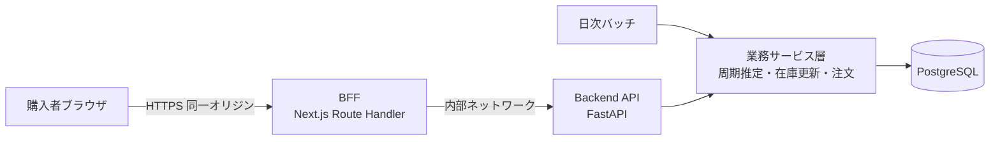

購入者のブラウザは BFF とのみ通信し、Backend API を直接呼ばない。BFF は同一オリジンで
Cookie を受け取り、内部ネットワーク経由で API を呼び出す。API はインターネットに直接公開
しない。

周期の推定ロジックは業務サービス層に置き、日次バッチと画面表示の両方から同じ実装を使う。
在庫の減算も同様に一本化し、単品購入とセット注文で同じ処理を通す。

### 1.2 技術構成

| 層 | 採用 | 選定理由 |
|---|---|---|
| Frontend | Next.js（TypeScript） | 型定義により、APIの入出力をコンパイル時に検査する |
| BFF | Next.js Route Handler | ブラウザと同一オリジンで Cookie を扱い、API を非公開に保つ |
| Backend | FastAPI（Python） | Pydantic による入力検証 |
| ORM | SQLAlchemy + Alembic | 問い合わせのパラメータバインドとスキーマ移行 |
| DB | PostgreSQL | 行ロックによる同時実行制御と、ウィンドウ関数による購入間隔の算出 |
| バッチ | Python スクリプト（cron 等で起動） | 業務サービス層を共有する |

購入間隔の算出に `LAG()` を使うため、ウィンドウ関数が使えることを前提とする（2.2）。
採用バージョンは実装開始時にサポート状況と既知の脆弱性を確認して固定する（8.8）。

### 1.3 作る範囲

| # | 機能 | 画面 |
|---|---|---|
| 1 | ログイン | 会員登録、ログイン |
| 2 | 商品表示 | 商品一覧、商品詳細 |
| 3 | 購入 | 注文確認、注文完了 |
| 4 | 購入履歴と定番セット | 履歴一覧、セット一覧、セット詳細、リマインド一覧、セット注文確認 |
| 5 | 下取りと割引券 | 下取り申込、申込状況、割引券一覧。管理者向けの受領登録 |
| 裏 | 日次バッチ | 画面なし |

---

## 2. UML

### 2.1 ユースケース図

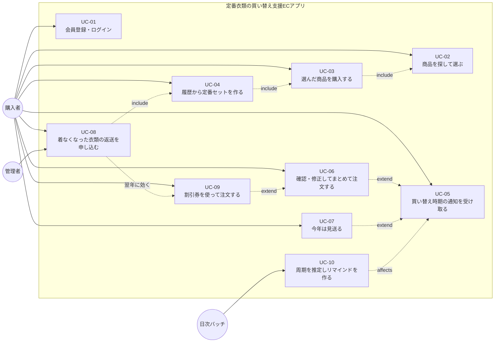

`UC-04` が `UC-03` を include するのは、**定番セットの材料が購入履歴だからである。**
一度も購入していなければセットを作れず、周期も推定できない。購入機能はセット機能の前提に
なっている。

`UC-08`（返送の申込）も購入履歴を材料にする。返す品目を履歴から選ぶことで、購入日と返送日の
差が「実際に何日使ったか」として残る。

`UC-08` から `UC-09` への破線は、**同一の買い替えサイクル内で完結しない**関係を表す。今年
返送して得た割引券は、翌年の買い替えで使う。この時間差が、返送を待たずにすぐ買えることと、
未返送のまま割引だけ渡さないことを両立させている。

### 2.2 アクティビティ図：買い替え周期の推定とリマインド生成

本アプリの中核となる処理である。「いつ買い替えるか」の判断がここで行われる。

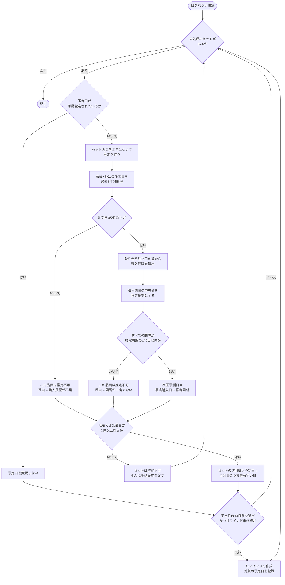

#### 設計判断1　なぜ「最も早い日」を採るか

セットの予定日は、推定できた品目の予測日のうち**最も早い日**とする。最も遅い日や平均を採ると、
早く必要になる品目が手遅れになる。まとめ買いは「一番早いものに合わせて全部買う」ことで成立
する。

#### 設計判断2　なぜ中央値か

購入間隔の代表値には中央値を用いる。引っ越しや突発的な買い足しなど、1回だけ外れた間隔に
引きずられないためである。3年で最大3回の購入なら間隔は最大2個であり平均との差は小さいが、
購入回数が増えても同じ計算式で扱える。

#### 設計判断3　ばらつき判定が効く条件

購入回数が2回のとき購入間隔は1個しかなく、中央値はその値そのものになる。したがって
「すべての間隔が中央値の±45日以内」は**常に成立する**。ばらつきによる推定不可が起きるのは
**3回以上購入した場合**である。

これは仕様の穴ではない。2回では間隔が1つしかないため、そもそもばらつきを評価できない。
確からしさの低さは数値ではなく、**推定値であることを明示し本人が修正できる設計**で補う
（F-18、F-20）。

#### 購入間隔の算出（例示）

```sql
-- 会員×SKUの購入間隔を、ウィンドウ関数で隣り合う注文日の差として求める
WITH purchases AS (
    SELECT DISTINCT o.ordered_at::date AS purchased_on
    FROM order_line ol
    JOIN orders o ON o.id = ol.order_id
    WHERE o.member_id = :member_id
      AND ol.sku_id  = :sku_id
      AND o.ordered_at >= CURRENT_DATE - INTERVAL '3 years'
)
SELECT purchased_on,
       purchased_on - LAG(purchased_on) OVER (ORDER BY purchased_on) AS gap_days
FROM purchases
ORDER BY purchased_on;
```

同じ日に同じSKUを複数回注文した場合を1回として数えるため、日付で `DISTINCT` を取る。
これをしないと間隔0日が混入し、推定周期が不当に短くなる。

### 2.3 シーケンス図

#### SD-01 会員登録・ログイン（UC-01）

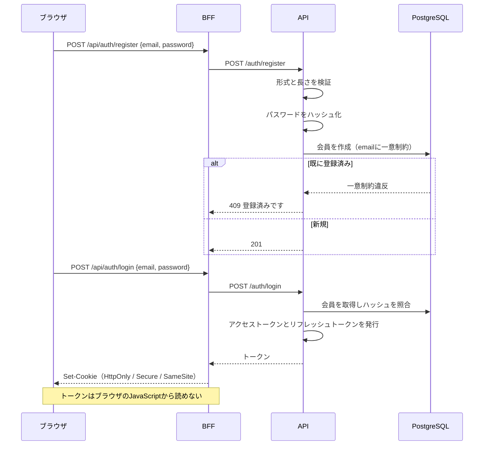

#### SD-02 購入履歴の表示と定番セットへの追加（UC-04）

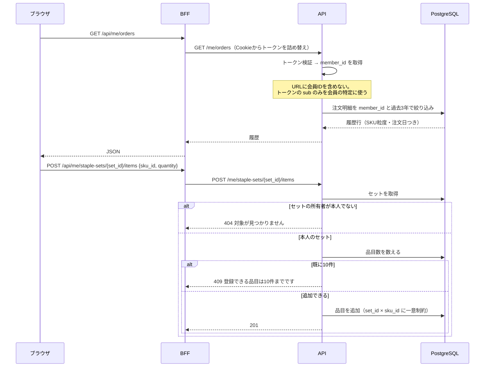

パスに `set_id` を含むため、**所有者の検証が必須**になる。他人のセットIDを指定された場合は
403ではなく404を返し、そのIDのセットが存在すること自体を伝えない（6.2）。

#### SD-03 定番セットのまとめ注文（UC-06）

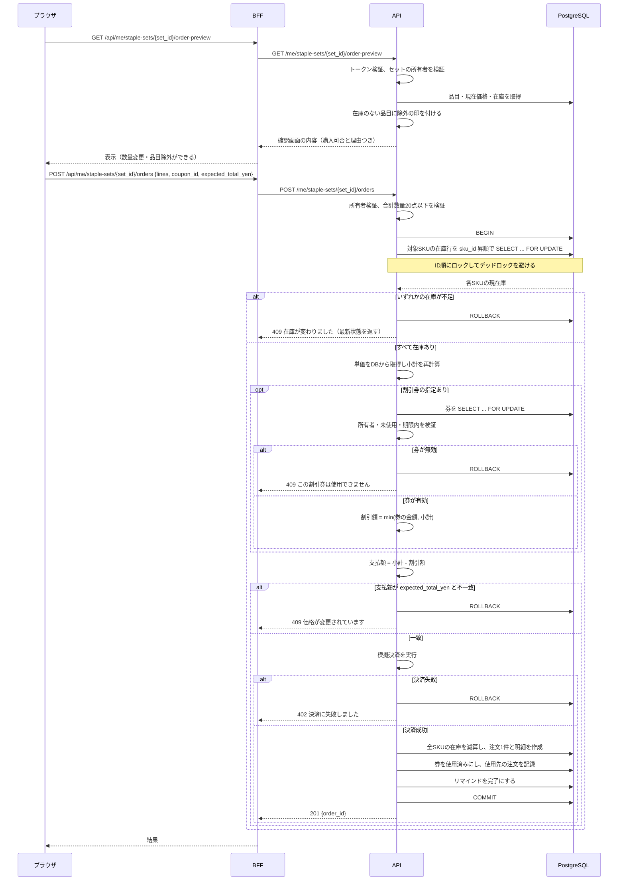

**部分的な成立を認めない。** 1品目でも成立しなければ全体をロールバックする。一部だけ買えた
状態を作ると、残りをどう扱うか（取り置き、追加注文、通知）という別の設計が必要になる。

在庫行は `sku_id` の昇順でロックする。複数の注文が異なる順序でロックを取ると、互いの解放を
待ち合ってデッドロックになるためである。

**割引券も同じトランザクションの中でロックし、使用済みにする。** 券の検証だけ先に済ませて
おき、あとで使用済みにする実装にすると、その間に別の注文が同じ券を使えてしまう。注文の成立と
券の消費は必ず一緒に確定させる。注文が不成立ならロールバックされ、券は未使用のまま残る。

### SD-04 下取りの申込と割引券の発行（UC-08）

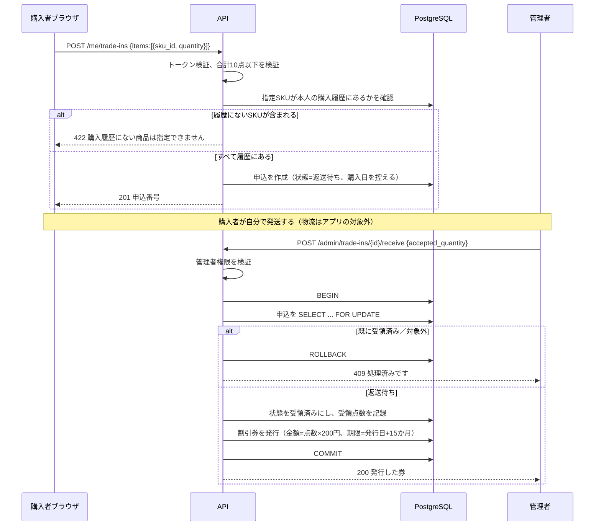

返送を購入履歴の品目と結びつけるのは、**購入日と返送日の差から「実際に何日使ったか」を
残すため**である。今回この値は使わないが、記録していなければ後から作れない（S5）。

受領登録は申込の行をロックしてから状態を確認する。二重に登録されても券が2枚発行されない
ようにするためである。

### 2.4 クラス図

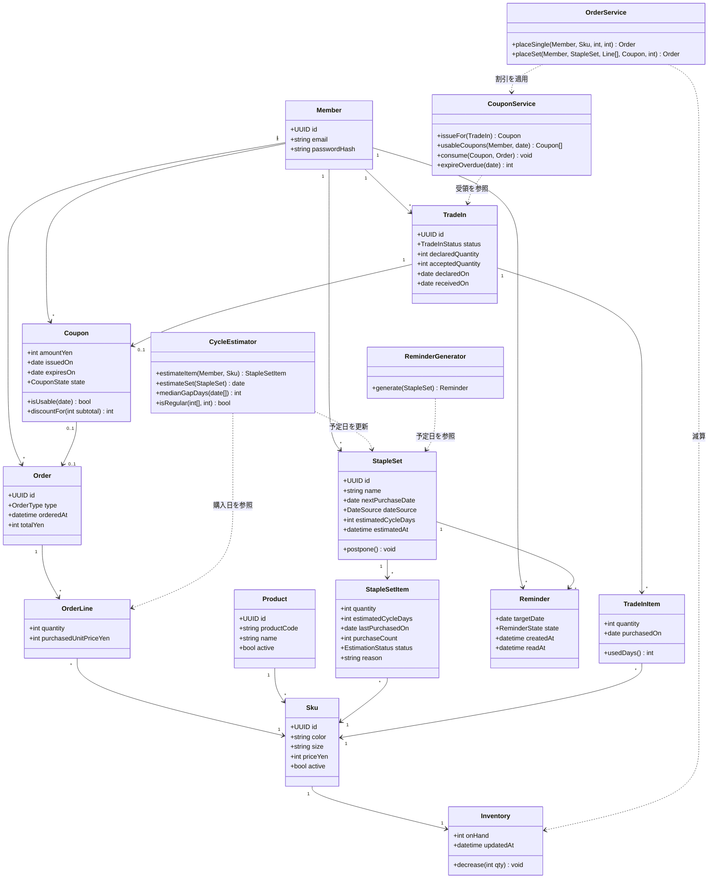

`CycleEstimator` は日次バッチと画面表示の両方から使う。`OrderService` は単品購入
（`placeSingle`）とセット注文（`placeSet`）で在庫減算のロジックを共有する。

`TradeInItem.usedDays()` は購入日と返送日の差を返す。今回この値は使わないが、返送を
購入履歴と結びつけて記録しているために算出できる。将来、購入間隔ではなく実使用期間から
周期を推定する場合（S5）の入力になる。

`Coupon.discountFor(subtotal)` が `min(amountYen, subtotal)` を返すことで、券の金額が
注文金額を上回っても支払額が負にならない。差額の繰り越しは扱わない。

---

## 3. ER図

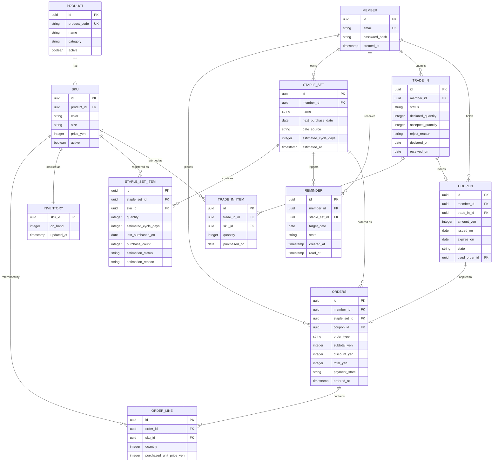

### 3.1 設計上の要点

| 項目 | 設計 | 理由 |
|---|---|---|
| `ORDER_LINE.sku_id` | 品番ではなくSKUを参照する | 周期の推定は「同じものを買った回数」を数える。SKU粒度がなければ成立しない。後からSKU化しても過去の色・サイズは復元できない |
| `ORDERS.ordered_at` | 明細から注文日をたどれるようにする | 推定は購入日の間隔から行う。集計値だけを保存すると間隔を再計算できない |
| `STAPLE_SET.date_source` | `ESTIMATED` / `MANUAL` / `NONE` を持つ | **これがないと、本人が設定した予定日を翌日のバッチが上書きしてしまう** |
| `STAPLE_SET.estimated_cycle_days` | セット単位でも周期を保持 | 「今年は見送る」で予定日を1周期分進めるために必要 |
| `STAPLE_SET_ITEM.estimation_status` | 推定できたかどうかと理由を保持 | 「なぜこの日付なのか」を画面で説明するため（F-18） |
| `STAPLE_SET_ITEM` | `(staple_set_id, sku_id)` に一意制約 | 同じSKUを重複して登録しない |
| `REMINDER` | `(staple_set_id, target_date)` に一意制約 | **バッチの二重実行で同じ予定日のリマインドを重複作成しない** |
| `ORDERS.staple_set_id` | セット注文の場合のみ設定（NULL許容） | どのセットから生まれた注文かを追える。単品購入では NULL |
| `PRODUCT.active` / `SKU.active` | 物理削除せず無効フラグで表す | 削除すると履歴とセットから商品情報を引けなくなる |
| 在庫 | SKU単位。店舗マスタを持たない | 店舗ごとの出し分けは今回の対象外 |
| 金額 | 整数（円） | 浮動小数点による誤差を避ける |
| `TRADE_IN_ITEM.sku_id` と `purchased_on` | 返送を点数だけで記録せず、購入履歴の品目と結びつける | 購入日と返送日の差が「実際に何日使ったか」を表す。点数だけでは、どの購入に対応するか後から特定できない（S5） |
| `COUPON.expires_on` | 発行時に確定して保持する | 有効期限の設定値（15か月）を後から変更しても、発行済みの券の期限が動かない。利用者に約束した期限を守るため |
| `COUPON.state` と `used_order_id` | 状態と使用先の注文を保持 | 二重使用の防止と、値引きの原資がどの注文に充当されたかの追跡 |
| `COUPON` の同時使用 | 使用時に券の行を `SELECT ... FOR UPDATE` でロックし、状態を確認してから使用済みにする | 同じ券を2件の注文へ同時に適用させない |
| `ORDERS.subtotal_yen` / `discount_yen` / `total_yen` | 割引前・割引額・支払額を分けて保持 | 合計だけを持つと、あとから割引の有無と金額を復元できない。会計上の値引き計上にも必要 |
| 日付 | 予定日・購入日・返送日・券の期限は `date` 型 | 周期と期限の計算は日単位で行う。時刻の差で結果が変わらないようにする |

---

## 4. API一覧

BFF は `/api/*` を受け、Backend の同名パスへ転送する。以下は Backend 側の契約を示す。

### 4.1 エンドポイント一覧

| # | メソッド・パス | 認可 | 対応機能 |
|---|---|---|---|
| 1 | POST /auth/register | 公開 | 1 ログイン |
| 2 | POST /auth/login | 公開 | 1 ログイン |
| 3 | POST /auth/refresh | リフレッシュトークン | 1 ログイン |
| 4 | POST /auth/logout | 認証済み | 1 ログイン |
| 5 | GET /products | 公開 | 2 商品表示 |
| 6 | GET /products/{product_id} | 公開 | 2 商品表示 |
| 7 | POST /me/orders | 本人のみ | 3 購入（単品） |
| 8 | GET /me/orders | 本人のみ | 4 購入履歴 |
| 9 | GET /me/staple-sets | 本人のみ | 4 定番セット |
| 10 | POST /me/staple-sets | 本人のみ | 4 定番セット |
| 11 | GET /me/staple-sets/{set_id} | **所有者検証** | 4 定番セット |
| 12 | PATCH /me/staple-sets/{set_id} | **所有者検証** | 4 定番セット（名前・予定日の手動設定／解除） |
| 13 | DELETE /me/staple-sets/{set_id} | **所有者検証** | 4 定番セット |
| 14 | POST /me/staple-sets/{set_id}/items | **所有者検証** | 4 定番セット |
| 15 | PATCH /me/staple-sets/{set_id}/items/{item_id} | **所有者検証** | 4 定番セット |
| 16 | DELETE /me/staple-sets/{set_id}/items/{item_id} | **所有者検証** | 4 定番セット |
| 17 | GET /me/staple-sets/{set_id}/order-preview | **所有者検証** | 4 セット注文の確認画面 |
| 18 | POST /me/staple-sets/{set_id}/orders | **所有者検証** | 4 セット注文 |
| 19 | GET /me/reminders | 本人のみ | 4 リマインド |
| 20 | POST /me/reminders/{reminder_id}/read | **所有者検証** | 4 リマインド |
| 21 | POST /me/reminders/{reminder_id}/skip | **所有者検証** | 4 見送り |
| 22 | POST /me/trade-ins | 本人のみ | 5 下取り申込 |
| 23 | GET /me/trade-ins | 本人のみ | 5 申込状況 |
| 24 | DELETE /me/trade-ins/{trade_in_id} | **所有者検証** | 5 申込の取消 |
| 25 | GET /me/coupons | 本人のみ | 5 割引券一覧 |
| 26 | POST /admin/trade-ins/{trade_in_id}/receive | **管理者権限** | 5 受領登録・券の発行 |
| 27 | POST /admin/trade-ins/{trade_in_id}/reject | **管理者権限** | 5 対象外の登録 |

パスに会員IDは含めない。対象の会員はアクセストークンの `sub` からのみ決定する。

一方、**セット・品目・リマインド・下取り申込は識別子をパスに含める。** これらは他人のIDを
指定できる経路になるため、`resource.member_id == token.sub` の検証を必須とする（8.2）。

`/admin/*` は管理者権限を要する別系統とする。購入者の認証情報では呼べない。受領の登録は
金銭的価値のある割引券の発行を伴うため、購入者側から到達できる経路を作らない。

### 4.2 入出力の型定義

型は TypeScript 表記で示す。Backend 側は Pydantic モデルで同じ制約を定義する。

#### 共通

```typescript
type EstimationStatus = "ESTIMATED" | "TOO_FEW_PURCHASES" | "IRREGULAR_INTERVAL";
type DateSource = "ESTIMATED" | "MANUAL" | "NONE";
```

#### 1 POST /auth/register ／ 2 POST /auth/login

```typescript
type AuthRequest = {
  email: string;      // 1〜254文字、メールアドレス形式
  password: string;   // 12〜128文字
};
// register: 201（本文なし） / login: 204 + Set-Cookie
```

#### 8 GET /me/orders

入力（クエリ文字列）：`page`（1〜1000、既定1）、`per_page`（1〜100、既定20）

```typescript
type OrderHistoryItem = {
  order_line_id: string;              // UUID
  order_id: string;                   // UUID
  ordered_on: string;                 // YYYY-MM-DD
  sku_id: string;                     // UUID
  product_code: string;
  product_name: string;
  color: string;
  size: string;
  quantity: number;                   // integer
  purchased_unit_price_yen: number;   // integer
  can_add_to_set: boolean;            // 無効化されたSKUは false
};
type OrderHistoryResponse = {
  items: OrderHistoryItem[];
  page: number;
  per_page: number;
  total: number;
};
```

#### 9 GET /me/staple-sets

```typescript
type StapleSetSummary = {
  set_id: string;                        // UUID
  name: string;
  item_count: number;                    // integer
  next_purchase_date: string | null;     // YYYY-MM-DD
  date_source: DateSource;
  estimated_cycle_days: number | null;   // integer
  estimated_at: string | null;           // ISO 8601
};
type StapleSetListResponse = { items: StapleSetSummary[] };
```

#### 11 GET /me/staple-sets/{set_id}

```typescript
type StapleSetItemDetail = {
  item_id: string;                       // UUID
  sku_id: string;                        // UUID
  product_name: string;
  color: string;
  size: string;
  quantity: number;                      // integer 1〜10
  purchase_count: number;                // integer 過去3年の購入回数
  last_purchased_on: string | null;      // YYYY-MM-DD
  estimated_cycle_days: number | null;   // integer
  next_expected_on: string | null;       // YYYY-MM-DD
  estimation_status: EstimationStatus;
  estimation_reason: string | null;      // 推定できない理由
};
type StapleSetDetailResponse = {
  set_id: string;
  name: string;
  next_purchase_date: string | null;
  date_source: DateSource;
  estimated_cycle_days: number | null;
  items: StapleSetItemDetail[];
};
```

`purchase_count` と `last_purchased_on` を返すのは、「なぜこの日付なのか」を購入者が
確認できるようにするためである（F-18）。推定を黒箱にしない。

#### 12 PATCH /me/staple-sets/{set_id}

```typescript
type UpdateStapleSetRequest = {
  name?: string;                          // 1〜50文字
  next_purchase_date?: string | null;     // YYYY-MM-DD を渡すと手動設定、null で解除
};
```

`next_purchase_date` に日付を渡すと `date_source` が `MANUAL` になり、以降のバッチで
上書きされない。`null` を渡すと `NONE` に戻り、次のバッチで再推定される。

#### 17 GET /me/staple-sets/{set_id}/order-preview

```typescript
type OrderPreviewLine = {
  item_id: string;
  sku_id: string;
  product_name: string;
  color: string;
  size: string;
  quantity: number;                    // integer セットに登録された数量
  current_unit_price_yen: number;      // integer
  purchasable: boolean;
  excluded_reason: string | null;      // 購入できない理由
};
type OrderPreviewResponse = {
  set_id: string;
  lines: OrderPreviewLine[];
  purchasable_total_yen: number;       // integer 購入可能な行のみの合計
  purchasable_quantity: number;        // integer 同上の合計数量
  usable_coupons: CouponItem[];        // 未使用かつ期限内。期限が近い順
  suggested_coupon_id: string | null;  // 既定で提示する券（最も期限が近いもの）
};
```

#### 18 POST /me/staple-sets/{set_id}/orders

```typescript
type SetOrderLine = {
  sku_id: string;      // UUID
  quantity: number;    // integer 1〜10
};
type CreateSetOrderRequest = {
  lines: SetOrderLine[];             // 1〜10件。確認画面で除外した行は含めない
  coupon_id: string | null;          // 適用する割引券。使わない場合は null
  expected_total_yen: number;        // integer 画面に表示していた支払額（割引後）
};
type CreateSetOrderResponse = {
  order_id: string;                  // UUID
  subtotal_yen: number;              // integer 割引前
  discount_yen: number;              // integer
  total_yen: number;                 // integer 支払額
  ordered_at: string;                // ISO 8601
};
```

合計数量が20点を超える場合は422で拒否する。`expected_total_yen` は保存や請求に使わず、
サーバ側の再計算との照合にのみ用いる。

#### 19 GET /me/reminders ／ 21 POST /me/reminders/{reminder_id}/skip

```typescript
type ReminderItem = {
  reminder_id: string;
  set_id: string;
  set_name: string;
  target_date: string;               // YYYY-MM-DD
  state: "UNREAD" | "READ" | "COMPLETED" | "SKIPPED";
  created_at: string;                // ISO 8601
};
type ReminderListResponse = { items: ReminderItem[] };

// skip の応答：次回購入予定日が推定周期の分だけ先へ進む
type SkipResponse = { next_purchase_date: string | null };
```

推定周期がない（手動設定のみの）セットで `skip` を呼んだ場合は、進める幅が決まらないため
`next_purchase_date` を `null` にして返し、本人に再設定を促す。

#### 22 POST /me/trade-ins

```typescript
type TradeInItemRequest = {
  sku_id: string;      // UUID 本人の購入履歴にあるSKUに限る
  quantity: number;    // integer 1以上10以下
};
type CreateTradeInRequest = {
  items: TradeInItemRequest[];   // 1〜10件。合計10点以下
};
type CreateTradeInResponse = {
  trade_in_id: string;
  status: "AWAITING";
  declared_quantity: number;
};
```

#### 23 GET /me/trade-ins

```typescript
type TradeInStatusCode = "AWAITING" | "RECEIVED" | "REJECTED" | "CANCELLED";

type TradeInSummary = {
  trade_in_id: string;
  status: TradeInStatusCode;
  declared_quantity: number;             // integer
  accepted_quantity: number | null;      // integer 受領後のみ
  reject_reason: string | null;
  declared_on: string;                   // YYYY-MM-DD
  received_on: string | null;            // YYYY-MM-DD
  issued_coupon_id: string | null;
};
type TradeInListResponse = { items: TradeInSummary[] };
```

#### 25 GET /me/coupons

```typescript
type CouponState = "UNUSED" | "USED" | "EXPIRED";

type CouponItem = {
  coupon_id: string;
  amount_yen: number;          // integer
  issued_on: string;           // YYYY-MM-DD
  expires_on: string;          // YYYY-MM-DD
  state: CouponState;
  used_order_id: string | null;
};
type CouponListResponse = { items: CouponItem[] };
```

#### 26 POST /admin/trade-ins/{trade_in_id}/receive

```typescript
type ReceiveTradeInRequest = {
  accepted_quantity: number;   // integer 0以上10以下。申告点数を超えない
};
type ReceiveTradeInResponse = {
  trade_in_id: string;
  accepted_quantity: number;
  coupon: CouponItem | null;   // 受領0点なら発行しない
};
```

受領点数は申告点数と一致しないことがある（一部が対象外など）。**割引券の金額は申告ではなく
受領点数から計算する。** 申告を信用して先に発行すると、送られていない分まで割引することに
なる。

---

## 5. 入力値の下限・上限

| 対象 | 型 | 下限 | 上限 | 既定 | 超過時 |
|---|---|---|---|---|---|
| email | string | 1文字 | 254文字 | — | 422 |
| password | string | 12文字 | 128文字 | — | 422 |
| q（商品名検索） | string | 0文字 | 100文字 | — | 422 |
| page | integer | 1 | 1000 | 1 | 422 |
| per_page | integer | 1 | 100 | 20 | 422 |
| quantity（単品購入） | integer | 1 | 10 | 1 | 422 |
| quantity（セット品目） | integer | 1 | 10 | 1 | 422 |
| セットの品目数 | integer | 0 | 10 | — | 409 |
| セット注文の行数 | integer | 1 | 10 | — | 422 |
| セット注文の合計数量 | integer | 1 | 20 | — | 422 |
| セット名 | string | 1文字 | 50文字 | — | 422 |
| next_purchase_date | date | 本日 | 本日＋3年 | — | 422 |
| expected_total_yen | integer | 0 | 10,000,000 | — | 422 |
| 最小購入回数（設定値） | integer | 2 | 10 | 2 | 起動時エラー |
| ばらつき許容日数（設定値） | integer | 0 | 180 | 45 | 起動時エラー |
| リマインド前倒し日数（設定値） | integer | 0 | 90 | 14 | 起動時エラー |
| 下取り申込の品目数 | integer | 1 | 10 | — | 422 |
| 下取り申込の合計点数 | integer | 1 | 10 | — | 422 |
| 受領点数（管理者入力） | integer | 0 | 申告点数 | — | 422 |
| 履歴の遡及年数（設定値） | integer | 1 | 5 | 3 | 起動時エラー |
| 1点あたりの割引額（設定値） | integer | 0 | 1,000 | 200 | 起動時エラー |
| 割引券の有効月数（設定値） | integer | 1 | 60 | 15 | 起動時エラー |
| 1注文に使える券の枚数（設定値） | integer | 1 | 1 | 1 | 起動時エラー |

`next_purchase_date` の下限を本日とするのは、過去日を設定すると即座にリマインドが作られ、
意味のない通知が発生するためである。上限を3年後とするのは、履歴の遡及期間と揃えている。

設定値は起動時に検証し、範囲外なら起動を失敗させる。実行中に不正な閾値で推定が走ることを
防ぐ。

受領点数の上限を申告点数とするのは、送られていない分まで割引しないためである。逆に受領0点も
許す。届いたものがすべて対象外だった場合にあたり、そのときは券を発行しない。

**割引券の有効月数を変更しても、発行済みの券の期限は動かない。** 期限は発行時に
`COUPON.expires_on` として確定させる（3.1）。設定値は次に発行する券から適用される。

---

## 6. エラー処理

### 6.1 HTTPステータスの割り当て

| ステータス | 条件 | 画面表示 | ログに残すもの／残さないもの |
|---|---|---|---|
| 400 | 形式不正（JSONが壊れている等） | 入力内容をご確認ください | 残す：パス、エラー種別／残さない：本文全体 |
| 401 | 未認証、トークン失効、ログイン失敗 | メールアドレスまたはパスワードが正しくありません | 残す：パス／残さない：トークン、パスワード |
| 402 | 模擬決済の失敗 | お支払いに失敗しました | 残す：注文の一時ID |
| 404 | 商品が存在しない。**他人のセット・品目・リマインド・注文を指定した場合も404** | 対象が見つかりません | 残す：パス、認証済み会員ID／残さない：要求されたID |
| 409 | 会員登録の重複、品目数の上限超過、在庫不足、価格変更、割引券が使用済み・失効・処理済みの下取り申込 | 状況に応じた説明を表示 | 残す：set_id、sku_id、coupon_id、判定結果 |
| 422 | 型・範囲の検証エラー（数量、合計点数、日付、文字列長、購入履歴にないSKUの下取り指定） | 項目ごとの説明を表示 | 残す：項目名と違反種別／残さない：値そのもの |
| 429 | 試行回数の超過（ログイン等） | しばらくしてからお試しください | 残す：発生元 |
| 500 | 想定外の例外 | 時間をおいてお試しください | 残す：スタックトレース、相関ID |

### 6.2 404 と 403 の使い分け

**権限のないリソースには404を返す。** 403を返すと、そのIDのリソースが存在することを要求者に
伝えてしまう。本アプリはパスに `set_id` `item_id` `reminder_id` を含むため、他人のIDを
指定する要求が実際に成立しうる。存在の有無自体を秘匿する。

**ログイン失敗も、メールアドレスの存在有無を区別しない。** 「登録されていません」と
「パスワードが違います」を出し分けると、どのメールアドレスが登録済みかを外部から調べられる。

### 6.3 409 と 422 の使い分け

| 種類 | 例 | ステータス |
|---|---|---|
| 入力そのものが不正（要求を作り直せば通る） | 数量11点、合計21点、日付が過去 | 422 |
| 入力は妥当だが、現在の状態と衝突する | 在庫不足、品目が既に10件、価格変更、券が使用済み・失効 | 409 |

422は画面側の入力制限で防げるもの、409は**サーバ側の状態を見ないと判断できないもの**である。
セット注文では両方が起こりうるため、購入者に示す文言を分ける。

### 6.4 バッチの失敗

| 事象 | 処理 |
|---|---|
| バッチが途中で失敗 | 当日分を再実行できる。推定は履歴からの再計算であり、リマインドは一意制約で重複しない |
| バッチが当日実行されなかった | 翌日の実行で追いつく。リマインドは「予定日の14日前を過ぎ、かつ未作成」で判定するため、1日遅れても作成される |
| 推定中に例外が発生したセットがある | そのセットのみ記録して次へ進み、他のセットの処理を止めない |
| 手動設定された予定日 | 推定処理をスキップする。バッチが本人の設定を壊さない |
| 割引券の失効処理が途中で失敗 | 期限判定は `expires_on < 本日` の再評価であり、再実行しても結果が変わらない |
| 失効処理が遅れた券が使われそうになる | 注文時にも `expires_on` を確認する。バッチの実行状況に依存せず、期限切れの券は適用できない |

---

## 7. 状態遷移

### 7.1 セットの次回購入予定日

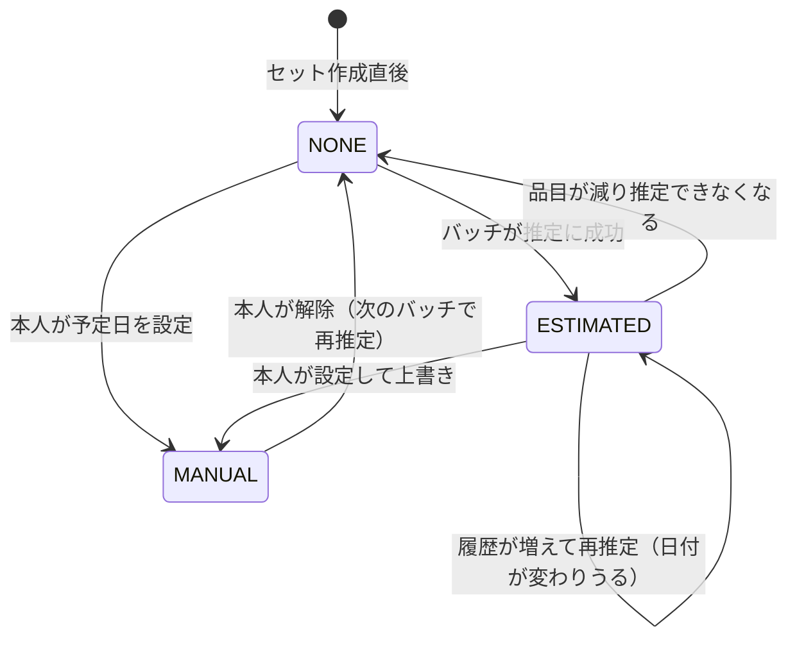

`MANUAL` の間、バッチは予定日を書き換えない。本人が明示的に解除するまで手動設定が優先される。

### 7.2 リマインド

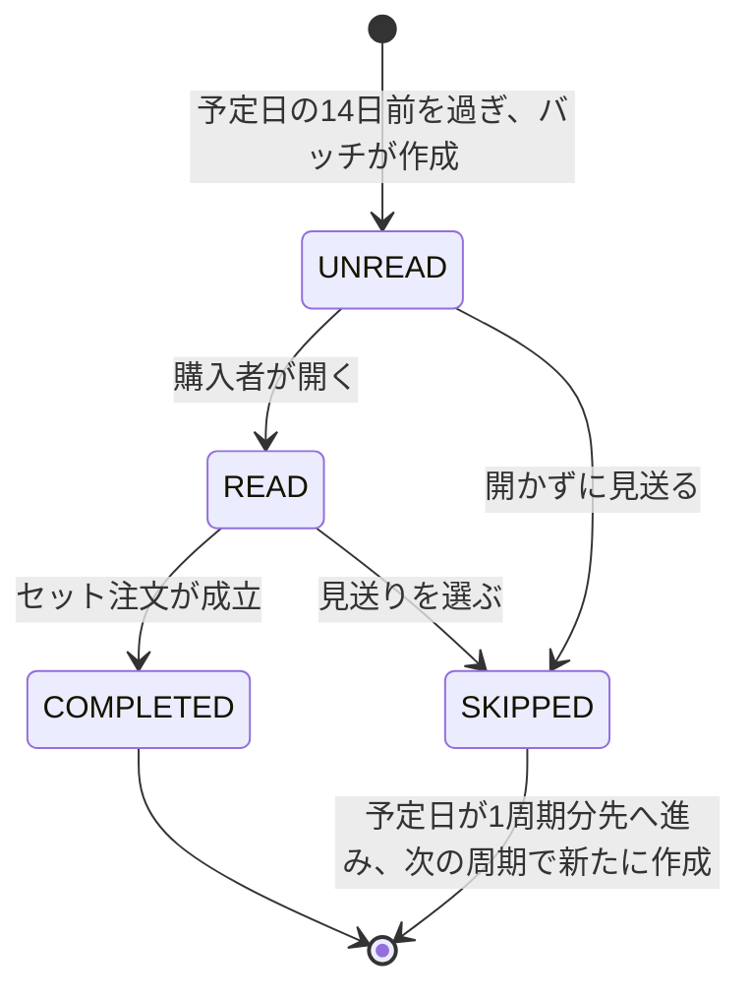

1つの予定日に対してリマインドは1件しか作らない。`(staple_set_id, target_date)` の一意
制約で担保する。

### 7.3 注文

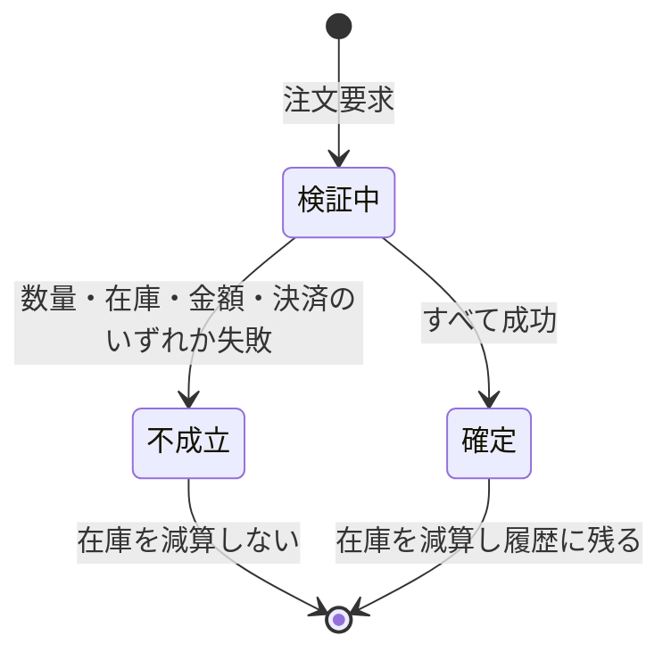

セット注文でも部分的な成立を認めない。取り置き・キャンセルを扱わないため中間状態を持たず、
在庫の確保と解放を設計しなくてよい。

### 7.4 下取り申込

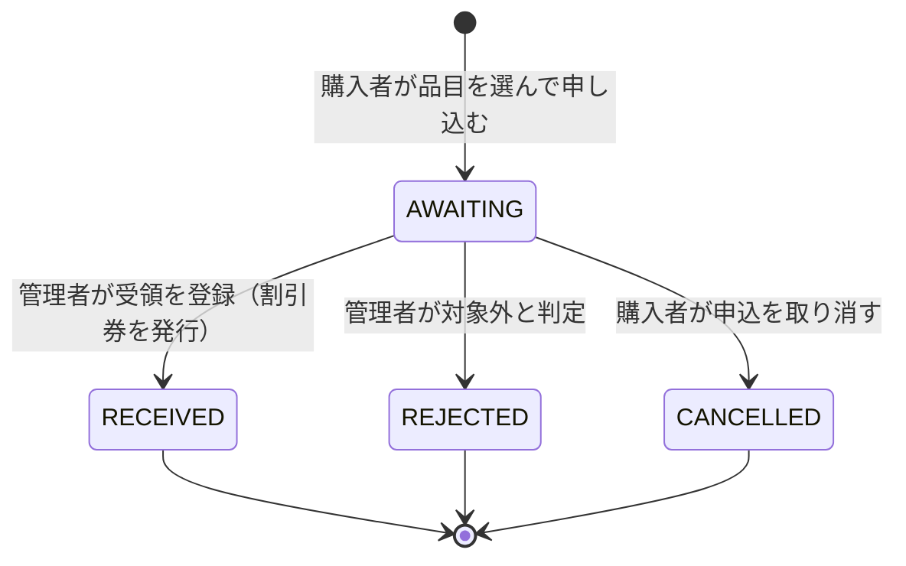

発送されないまま残る申込に期限を設けない。券をまだ発行していないため事業者側に損失がなく、
期限切れの処理を作る必要がないためである。

### 7.5 割引券

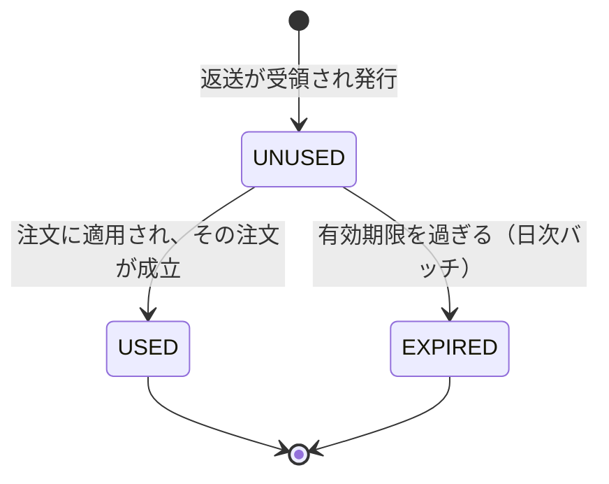

注文が不成立の場合、券は `UNUSED` のまま残る。券の消費は注文の確定と同じトランザクションで
行い、片方だけが確定する状態を作らない。

`USED` と `EXPIRED` はいずれも最終状態とする。失効した券の復活・再発行は扱わない。

---

## 8. セキュリティ設計

### 8.1 認証（JWT）

| 項目 | 設計 |
|---|---|
| アクセストークン | 有効期限15分。署名アルゴリズムを明示的に固定し、`alg: none` や算法差し替えを受け付けない |
| リフレッシュトークン | 有効期限7日。データベースに保管し、使用時にローテーションする。再利用を検知したら系列全体を失効させる |
| 保管場所 | HttpOnly・Secure・SameSite=Lax の Cookie。**localStorage や sessionStorage に置かない** |
| 失効 | ログアウト時にリフレッシュトークンを削除する |
| パスワード | bcrypt 等のハッシュ関数で保存する。平文・可逆暗号で保存しない |
| ログイン試行 | 回数制限を設ける。失敗理由を出し分けない（6.2） |

localStorage を使わないのは、スクリプト経由でトークンが読み出される事故を、保管方法の段階で
防ぐためである。HttpOnly Cookie はJavaScriptから参照できない。

### 8.2 認可

本アプリが扱うのは購入履歴と定番セットである。**何をいつ買い替えているかは購買行動そのもの**
であり、履歴と同等に保護する。

| 対策 | 内容 |
|---|---|
| 会員の特定 | アクセストークンの `sub` からのみ会員を決定する。リクエストボディ・クエリの会員IDを信用しない |
| 所有者検証 | `set_id` `item_id` `reminder_id` `trade_in_id` `coupon_id` を扱うエンドポイントでは、必ず `resource.member_id == token.sub` を検証する |
| 管理者の分離 | `/admin/*` は管理者権限を要する別系統とする。受領登録は金銭的価値のある割引券の発行を伴うため、購入者の認証情報では到達できないようにする |
| 券の適用 | 注文に指定された `coupon_id` について、所有者・未使用・期限内をサーバ側で検証する。画面が提示した券であっても、確定時に取り直す |
| 入れ子の検証 | `/staple-sets/{set_id}/items/{item_id}` では、品目が**そのセットに属すること**も確認する。セットが本人のものでも、他セットの品目IDを指定できてはならない |
| 検証位置 | 検証は Backend で行う。BFF や画面側の表示制御だけに依存しない |
| 情報漏れの抑止 | 他人のリソースには404を返し、存在の有無を伝えない（6.2） |

入れ子の検証は見落としやすい。`set_id` だけを検証して `item_id` を信用すると、自分のセットの
IDと他人の品目のIDを組み合わせた要求が通ってしまう。

### 8.3 BFF（リバースプロキシ）

- ブラウザは BFF とのみ通信する。Backend API はインターネットに公開しない。
- BFF は Cookie からトークンを取り出し、Backend への `Authorization` ヘッダに詰め替える。
  ブラウザ側のJavaScriptはトークンを保持しない。
- BFF は転送先パスを固定の許可リストで制限し、任意のURLへ中継しない（SSRF対策）。
- Backend は BFF の送信元のみを受け付けるようネットワークで制限する。

### 8.4 CORS

- ブラウザから見て BFF は同一オリジンであるため、通常の画面操作でCORSは発生しない。
- Backend 側の CORS 設定は、許可オリジンを BFF のオリジンのみに限定する。`*` を使わない。
- 認証情報を伴う通信では、仕様上 `allow_origins` にワイルドカードを指定できない。
  許可オリジンは環境変数で明示する。
- 許可メソッド・許可ヘッダも必要なものだけに限定する。

### 8.5 サーバ側での計算と照合

| 対象 | 設計 |
|---|---|
| 金額 | クライアントから受け取った `expected_total_yen` を保存や請求に使わない。単価はDBから取得して小計を再計算し、一致しない場合は409で拒否する |
| 割引額 | クライアントが送る割引額を信用しない。券の金額はDBから取得し、`min(券の金額, 小計)` をサーバ側で計算する。**支払額が負にならないことを計算式で保証する** |
| 券の枚数 | 1注文1枚をサーバ側で検証する。複数指定されたリクエストは422で拒否する |
| 数量 | 単品10点、セット注文の合計20点をサーバ側で検証する。画面の入力制限だけに依存しない |
| 品目数 | セットの上限10件をサーバ側で検証する |
| 在庫 | 確認画面の値ではなく、注文確定時に行ロックを取って再判定する |
| 購入可否 | クライアントが送る `purchasable` を信用しない。注文処理時に改めて判定する |

確認画面（`order-preview`）は**表示のための情報であり、注文の根拠ではない。** 画面を開いて
から確定するまでの間に在庫・価格・券の状態が変わりうるため、確定時にすべて取り直す。券に
ついては、確認画面を開いたあとに別の注文で使われている可能性がある。

割引額を `min(券の金額, 小計)` として計算するのは、**支払額が負になる経路を計算式の段階で
消すため**である。「差額を繰り越す」「マイナスを0に丸める」といった後段の補正に頼ると、
補正を忘れた経路から不正な金額が通りうる。

### 8.6 API仕様書の非公開

FastAPI は既定で `/docs`、`/redoc`、`/openapi.json` を公開する。本番環境ではすべて無効化
する。`openapi.json` を残すとスキーマ全体が取得できるため、3つとも止める。

```python
is_production = settings.ENV == "production"

app = FastAPI(
    docs_url=None if is_production else "/docs",
    redoc_url=None if is_production else "/redoc",
    openapi_url=None if is_production else "/openapi.json",
)
```

### 8.7 SQLインジェクション対策

| 層 | 対策 |
|---|---|
| Frontend | TypeScript で API の入出力型を定義し、想定外の値の送信をコンパイル時に検出する |
| Backend 入口 | Pydantic モデルで型・範囲・書式を検証する。UUIDはUUID型として受け取り、文字列のまま扱わない |
| データアクセス | SQLAlchemy のクエリビルダを使い、値をパラメータとしてバインドする |
| 生SQL | 購入間隔の算出のようにウィンドウ関数を使う箇所では `text()` とバインドパラメータを用いる。文字列連結・書式化でSQLを組み立てない |

商品名の部分一致検索と、購入間隔を求める集計クエリが、利用者由来の値を扱う主な箇所である。

```python
# 不可：値をSQL文字列に埋め込む
session.execute(text(f"SELECT * FROM product WHERE name LIKE '%{q}%'"))

# 可：パラメータとしてバインドする
session.execute(
    text("SELECT * FROM product WHERE name LIKE :pattern"),
    {"pattern": f"%{q}%"},
)
```

### 8.8 依存ライブラリの脆弱性

- 採用するフレームワーク・ライブラリのバージョンを一覧化し、実装開始時にサポート状況と
  既知の脆弱性を確認して固定する。
- 依存関係の検査（Python は `pip-audit`、Node.js は `npm audit`）を実施し、継続的に
  確認できるようにする。
- ロックファイルをリポジトリに含め、環境間でバージョンを一致させる。
- 検査結果と対応方針を記録し、対応できないものは理由を残す。

### 8.9 秘密情報とログ

- 認証情報・署名鍵・接続情報は環境変数で管理し、リポジトリに含めない。
- ログにトークン、パスワード、購入履歴・定番セット・下取り申込の内容を出力しない。割引券のIDは調査に必要なため残すが、金額と結びつく個人の購買情報として扱う。
- エラーには相関IDを付与し、利用者には内部構造を表示しない。
- 公開環境ではHTTPSを使用する。

---

## 9. 検証計画

要件定義書の受け入れ確認項目 A-01〜A-20 を受け入れテストとして実装する。特に重要なものを
以下に示す。

### 9.1 推定ロジックの境界値

| 対象 | 確認内容 |
|---|---|
| 最小購入回数 | 購入1回では推定不可（`TOO_FEW_PURCHASES`）、2回で推定される |
| ばらつき許容 | 3回購入で間隔差が45日なら推定され、46日なら推定不可（`IRREGULAR_INTERVAL`） |
| 2回購入時のばらつき | 2回購入では間隔が1つのため、常に推定される（ばらつき判定が効かないことの確認） |
| 中央値 | 間隔が3つ（300日・365日・800日）のとき、推定周期が365日になる（平均の488日ではない） |
| 最も早い日 | 品目Aの予測日が3月1日、品目Bが5月1日のとき、セットの予定日が3月1日になる |
| 同日重複購入 | 同じ日に同じSKUを2回注文しても、間隔0日が混入しない |
| 遡及期間 | 3年ちょうど前の購入が推定に含まれ、3年と1日前は含まれない |
| リマインド | 予定日の15日前では作成されず、14日前で作成される |

### 9.2 手動設定の保護

| 対象 | 確認内容 |
|---|---|
| 上書き防止 | 手動設定した予定日が、バッチ実行後も変わらない |
| 解除 | 手動設定を解除すると、次のバッチで推定値に戻る |
| 見送り | 見送ると予定日が推定周期の分だけ進み、同じ予定日のリマインドが再作成されない |
| 周期なしの見送り | 手動設定のみのセットで見送ると、予定日が null になり再設定を促される |

### 9.3 認可

| 対象 | 確認内容 |
|---|---|
| 他人のセット | 他人の `set_id` を指定した取得・更新・削除が404になる |
| 入れ子 | 自分の `set_id` と他人の `item_id` を組み合わせた要求が404になる |
| 他人のリマインド | 他人の `reminder_id` への既読・見送りが404になる |
| 未認証 | ログインせずに `/me/*` を要求すると401になる |
| トークン改ざん | 署名を書き換えたトークンが拒否される |
| ログイン失敗 | 未登録メールと誤ったパスワードで、同じ応答が返る |

### 9.4 注文の原子性・同時実行

| 対象 | 確認内容 |
|---|---|
| 部分成立の禁止 | 3品目のうち1品目が在庫切れのとき、注文全体が不成立になり、他2品目の在庫も減っていない |
| 同時注文 | 在庫1のSKUへ同時に2件注文すると、成立は1件のみ。在庫が負にならない |
| デッドロック | 品目の並び順が異なる2つのセット注文を同時に実行しても、デッドロックしない |
| 二重送信 | 注文ボタンの二重クリックで注文が2件成立しない |
| 決済失敗 | 決済に失敗した注文で在庫が減っていない |
| 上限 | 合計21点の注文が422で拒否される |

### 9.5 下取りと割引券

| 対象 | 確認内容 |
|---|---|
| 履歴の検証 | 購入履歴にないSKUを指定した申込が422で拒否される |
| 申込点数 | 合計10点の申込は成立し、11点は422で拒否される |
| 受領点数 | 申告10点に対し受領7点を登録すると、券の金額が1,400円になる |
| 受領0点 | 受領0点を登録すると券が発行されない |
| 二重受領 | 同じ申込に2回受領を登録しても、券は1枚しか発行されない |
| 有効期限 | 発行日から15か月後の当日は使え、翌日は失効して適用できない |
| 期限の固定 | 設定値を12か月に変更しても、発行済みの券の期限が変わらない |
| 上限クリップ | 券2,000円を小計1,500円の注文に使うと、支払額が0円になり差額が繰り越されない |
| 二重使用 | 同じ券を2件の注文へ同時に適用すると、成立するのは1件のみ |
| 不成立時 | 在庫切れで注文が不成立になったとき、券が未使用のまま残る |
| 他人の券 | 他人の `coupon_id` を指定した注文が拒否される |
| 管理者API | 購入者の認証情報で `/admin/trade-ins/{id}/receive` を呼べない |

### 9.6 バッチの冪等性

| 対象 | 確認内容 |
|---|---|
| 二重実行 | 同日に2回実行しても、予定日とリマインド件数が変わらない |
| 途中失敗からの再実行 | 再実行後の結果が、単独実行時と一致する |
| 例外の隔離 | 1つのセットで例外が起きても、他のセットの推定が完了する |
| 券の失効 | 同日に2回実行しても、失効した券の件数と状態が変わらない |

### 9.7 検証用データ

- 会員：複数会員を用意し、他人のセットを参照できないことを確認できるようにする。
- 購入履歴：
  - 購入1回のみのSKU（推定不可）
  - 購入2回、間隔365日のSKU（推定可）
  - 購入3回、間隔が365日・366日のSKU（推定可）
  - 購入3回、間隔が200日・400日のSKU（ばらつきで推定不可）
  - 同じ日に2回購入したSKU
  - 3年ちょうど前と3年と1日前の購入
- 在庫：0のSKUと1のSKUを含め、確認画面での除外と同時注文を再現できるようにする。
- セット：推定できるもの、推定できないもの、手動設定済みのものを各1件以上。
- 下取り申込：返送待ち、受領済み、対象外、取消済みを各1件以上。
- 割引券：未使用で期限内、期限当日、期限翌日（失効）、使用済み、金額が注文額を上回るものを
  各1件以上。他会員の券も1件用意し、他人の券を使えないことを確認できるようにする。

### 9.8 検証環境の注意

同時実行の検証は PostgreSQL 上で、独立した接続・トランザクションを用いて実際に並行実行
する。SQLite では行ロックの挙動が異なり、ウィンドウ関数の対応状況も異なるため、在庫の排他
制御と購入間隔の算出の検証には使用しない。

---

## 10. 将来、店頭POSと接続する場合に必要となる変更

今回はPOSと接続しないが、Lv2で開発したPOSは単一店舗内で会計を完結させる前提で成立して
いたため、将来ECと接続する場合には設計の変更が必要になる。着手前に整理しておく。

| # | 変更内容 | なぜ必要か | 後から取り戻せるか |
|---|---|---|---|
| 1 | 商品管理を品番単位からSKU単位へ変更する | 色・サイズを区別しなければ「同じものを買った回数」を数えられない | 仕組みは後から追加できる |
| 2 | 取引明細にSKUと取引日を保存する | 周期の推定は購入日の間隔から行う | **取り戻せない。** 記録前の取引の色・サイズと日付は復元できない |
| 3 | 取引に会員IDを保存する | 店頭購入を誰の周期に含めるか判別するため | **取り戻せない。** 記録前の取引が誰のものか判別できない |
| 4 | 会計確定時に在庫を減算する処理を追加する | Lv2のPOSは在庫そのものを持っていない | 仕組みは後から追加できる |
| 5 | 商品マスタの終売を論理削除に変更する | 物理削除すると、履歴とセットから商品情報を引けなくなる | **取り戻せない。** 削除済みの商品情報は復元できない |
| 6 | 販売イベントをEC側へ送信する仕組みを追加する | 店頭購入をECの履歴と在庫に反映するため | 仕組みは後から追加できる |

これはLv2のPOSに機能が不足していたという意味ではない。単一店舗で完結する前提では、その設計で
成立していた。利用範囲が店舗の外へ広がったことで、前提が変わったために生じる変更である。

**2・3・5は、記録を始める前の情報を後から作れない。** 店頭購入を周期の推定に含める段階
（S3）でこの3項目が必要になるが、そのときに過去分を遡れない。接続の予定があるなら、この3点
だけは接続を待たずにPOS側へ入れておく必要がある。

接続の際は `POST /pos/sales` のような受け口を設け、`(client_id, event_id)` の一意制約で
重複受信を排除する。在庫減算は `OrderService` と同じ業務サービス層を通す。

---

## 11. 未決定事項

| ID | 未決定事項 | 現時点の案 |
|---|---|---|
| D-01 | 採用バージョン | 実装開始時にサポート状況と脆弱性を確認して固定する |
| D-02 | バッチの実行基盤と時刻 | 1日1回とする案。基盤と時刻は未定 |
| D-03 | 配送リードタイムの実測 | リマインドの14日前は配送最大7日という仮定に基づく。実績で見直す |
| D-04 | ばらつき許容の妥当性 | ±45日は実測にもとづかない。運用後に見直す |
| D-05 | 品番が変わった定番商品の扱い | 同一SKUの履歴が途切れると推定が働かない。世代の紐づけは将来スコープS4 |
| D-06 | 通知の配信方法 | アプリ内通知のみとする案 |
| D-07 | 在庫の補充方法 | 管理者が理由付きで登録・調整する案 |
| D-08 | 模擬決済の実現方法 | 成功・失敗を選べる学習用のダミー処理とする案 |
| D-09 | 公開先・データ保持期間 | 公開前に具体化する |
| D-10 | 返送の受付条件 | 対象とする衣類の範囲（自店で購入したものに限るか）、著しい汚損の判断基準 |
| D-11 | 検品の担当と方法 | 受領点数と可否を誰がどう入力するか。今回は管理者の手入力とする案 |
| D-12 | 割引券の会計上の扱い | 発行時点で負債計上するか、使用時に値引き計上するか |
| D-13 | 返送の送料負担 | 事業者負担（着払い）とするか購入者負担とするか。1点200円の妥当性に影響する |

D-03とD-05は予測の実用性に直接関わるため、実装前に優先して確定する。

---

## 12. 参照

- スクール配布資料『Lv3のスコープを決める』：課題の立て方、対象外の明示、将来スコープ、
  数値とその理由、POS変更の検討観点。
- [FastAPI 公式ドキュメント：Metadata and Docs URLs](https://fastapi.tiangolo.com/tutorial/metadata/)
- [MDN：Cross-Origin Resource Sharing (CORS)](https://developer.mozilla.org/en-US/docs/Web/HTTP/CORS)
- [MDN：Set-Cookie（HttpOnly、Secure、SameSite）](https://developer.mozilla.org/en-US/docs/Web/HTTP/Headers/Set-Cookie)
- [PostgreSQL 公式ドキュメント：ウィンドウ関数](https://www.postgresql.org/docs/current/tutorial-window.html)
- [SQLAlchemy 公式ドキュメント：Textual SQL とバインドパラメータ](https://docs.sqlalchemy.org/en/20/core/sqlelement.html#sqlalchemy.sql.expression.text)

上記は仕組みを確認するための参照であり、特定バージョンの採用を確定するものではない。
本書における設計意図の解釈には推論が含まれる。

---

## 13. 生成AIの利用

<!-- 本人が記入 -->
